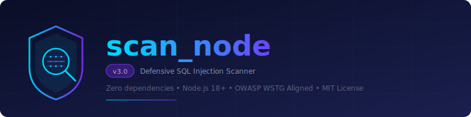

<p align="center">
  
</p>

<p align="center">
  <a href="LICENSE"></a>
  
  
  
</p>

<p align="center">
  <strong>scan_node</strong> is a zero-dependency, defensive SQL injection scanner for Node.js. It crawls a target web application, discovers input vectors, and evaluates responses for signs of SQLi vulnerabilities — all whilst remaining within the boundaries of authorised security testing.
</p>

---

## Table of Contents

- [Overview](#overview)
- [Features](#features)
- [Prerequisites](#prerequisites)
- [Installation](#installation)
- [Usage](#usage)
  - [Basic Usage](#basic-usage)
  - [Safe Mode (Default)](#safe-mode-default)
  - [Active SQLi Testing](#active-sqli-testing)
  - [Extended Payloads](#extended-payloads)
  - [Authentication and Custom Headers](#authentication-and-custom-headers)
  - [Command-Line Reference](#command-line-reference)
- [Output Format](#output-format)
- [Detection Methodology](#detection-methodology)
- [OWASP Top 10:2025 Mapping](#owasp-top-102025-mapping)
- [Legality and Authorised Use](#legality-and-authorised-use)
- [Disclaimer and Limitations](#disclaimer-and-limitations)
- [Contributing](#contributing)
- [Licence](#licence)

---

## Overview

**scan_node** is a command-line security tool written in pure JavaScript (ES Modules) that operates atop the Node.js runtime. It has been developed for penetration testers, security researchers, and application developers who require a lightweight, auditable instrument for identifying SQL injection flaws in web applications they own or are explicitly authorised to test.

The scanner functions in two distinct phases:

1. **Crawling** — Starting from a supplied URL, it traverses up to *N* pages (configurable), extracting URL query parameters and HTML form inputs.
2. **Active Testing** — For each discovered input vector, it dispatches baseline and payload-bearing HTTP requests, then evaluates the responses using heuristic analysis (error signature matching, boolean differential analysis, and HTTP status code comparison).

The current stable version is **v3.0** (`scanner_v3.js`), which introduces safe mode, passive security header checks, extended payload sets, and OWASP-categorised findings.

## Features

| Feature | Description |
|---------|-------------|
| **Zero Dependencies** | Utilises exclusively Node.js built-in modules; no `npm install` required. |
| **Safe Mode by Default** | Active SQLi payloads are disabled unless explicitly opted in (`--safe=false`). |
| **Passive Security Checks** | Evaluates HTTP security headers (HSTS, CSP, X-Content-Type-Options) and cookie attributes. |
| **Extended Payloads** | Optional UNION-based and time-based SQLi probes (`--extended-payloads=true`). |
| **Boolean Differential Analysis** | Compares responses for `true`/`false` boolean payloads to detect blind SQLi. |
| **Multi-DBMS Error Detection** | Recognises error signatures from MySQL, PostgreSQL, SQLite, MSSQL, and Oracle. |
| **OWASP Top 10:2025 Tagging** | Each finding is classified under the relevant OWASP category. |
| **JSON Report Output** | Structured, machine-readable report suitable for integration into CI/CD pipelines. |
| **Custom Authentication** | Supports cookies and arbitrary HTTP headers for authenticated scanning. |

## Prerequisites

- **Node.js** ≥ 18.x (required for native `fetch()` and `AbortSignal.timeout()`)
- Network access to the target application
- **Written authorisation** to test the target (see [Legality and Authorised Use](#legality-and-authorised-use))

## Installation

No installation step is necessary. Clone or download the repository and execute the scanner directly:

```bash
git clone https://github.com/user/scan_node.git
cd scan_node
node scanner_v3.js --help
```

## Usage

### Basic Usage

```bash
node scanner_v3.js <target-url>
```

This initiates a crawl of the target URL (up to 20 pages by default), restricted to the same origin, in **safe mode** (passive checks only; no active SQLi payloads are dispatched).

### Safe Mode (Default)

Safe mode is the default operating mode. In this mode, the scanner performs only passive assessments:

- Crawls the target application and enumerates input vectors.
- Evaluates HTTP response headers for security misconfigurations.
- Inspects `Set-Cookie` attributes for missing `HttpOnly`, `Secure`, and `SameSite` flags.
- Detects forms that use the `GET` method (informational).

```bash
node scanner_v3.js https://example.com
```

### Active SQLi Testing

To enable active SQL injection testing, set `--safe=false`:

```bash
node scanner_v3.js https://example.com --safe=false
```

This instructs the scanner to dispatch SQLi-specific payloads (single quote, semicolons, boolean true/false probes) against each discovered input vector.

### Extended Payloads

For comprehensive testing, enable extended payloads alongside active mode:

```bash
node scanner_v3.js https://example.com --safe=false --extended-payloads=true
```

Extended payloads include:

- **UNION-based**: `' UNION SELECT NULL--`
- **Time-based**: `' OR SLEEP(3)--`
- **Comment-close**: `')--`

### Authentication and Custom Headers

For scanning authenticated pages, supply cookies and/or custom headers:

```bash
# Cookie-based authentication
node scanner_v3.js https://example.com --cookie="session=abc123"

# Custom headers (repeatable)
node scanner_v3.js https://example.com --header="Authorization: Bearer token123" --header="X-Custom: value"
```

### Command-Line Reference

| Flag | Default | Description |
|------|---------|-------------|
| `--max-pages=N` | `20` | Maximum number of pages to crawl. |
| `--timeout=N` | `8000` | HTTP request timeout in milliseconds. |
| `--delay=N` | `250` | Delay between consecutive requests in milliseconds. |
| `--same-origin=true\|false` | `true` | Restrict crawling to the same origin as the target URL. |
| `--out=FILENAME` | `report.json` | Path to the output report file. |
| `--cookie=VALUE` | — | Cookie header value to include in requests. |
| `--header="K: V"` | — | Custom HTTP header (may be repeated). |
| `--safe=true\|false` | `true` | When `false`, enables active SQLi payload testing. |
| `--extended-payloads=true\|false` | `false` | Include UNION and time-based payloads (requires `--safe=false`). |
| `--allow-http-fallback=true\|false` | `false` | Fall back to HTTP if HTTPS connection fails. |
| `--user-agent=STRING` | `scan-node/3.0` | Custom `User-Agent` header value. |
| `--concurrency=N` | `1` | Number of concurrent requests (experimental). |

## Output Format

The scanner produces a structured JSON report. The default output file is `report.json`.

```jsonc
{
  "target": "https://example.com",
  "started_at": "2025-07-14T10:30:00.000Z",
  "scanner": "scan-node/3.0",
  "pages_crawled": 12,
  "pages_scanned": 8,
  "findings": [
    {
      "type": "SQLi-Boolean",
      "confidence": "high",
      "url": "https://example.com/search?q=",
      "param": "q",
      "evidence": "SQL error pattern matched: mysql.*server version",
      "owasp": "A05:2025-Injection"
    }
  ],
  "passive_findings": [
    {
      "type": "Missing-HSTS",
      "url": "https://example.com/",
      "severity": "medium",
      "description": "Strict-Transport-Security header is absent.",
      "owasp": "A02:2025-Security-Misconfiguration"
    }
  ],
  "interesting_headers": [
    { "url": "https://example.com/", "server": "nginx/1.18.0" }
  ]
}
```

## Detection Methodology

### SQL Injection Detection

The scanner employs the following heuristic techniques:

1. **Error-Based Detection** — Matches response body content against 15 known SQL error signature patterns (MySQL, PostgreSQL, SQLite, MSSQL, Oracle).
2. **Boolean Differential Analysis** — Sends paired `true`/`false` boolean payloads and compares responses using character-level similarity scoring. A similarity below 0.90 between paired responses indicates a likely SQLi.
3. **HTTP Status Code Analysis** — Detects unexpected status code changes between baseline and payload responses.
4. **Response Body Delta** — Flags significant body size differences (>15% or >120 characters) between baseline and payload responses.

### Passive Security Checks

The v3 scanner additionally evaluates:

- **Strict-Transport-Security** presence on HTTPS endpoints.
- **Content-Security-Policy** header presence.
- **X-Content-Type-Options** header presence.
- **Set-Cookie** attributes (`HttpOnly`, `Secure`, `SameSite`).
- **Form method** (GET vs POST, informational).

## OWASP Top 10:2025 Mapping

| Finding Category | OWASP Classification |
|-----------------|----------------------|
| SQL Injection (Boolean, Error, UNION, Time-based) | [A05:2025 — Injection](https://owasp.org/Top10/A05_2021-Injection/) |
| Missing Security Headers | [A02:2025 — Security Misconfiguration](https://owasp.org/Top10/A02_2021-Cryptographic_Failures/) |
| Insecure Cookie Attributes | [A07:2025 — Identification and Authentication Failures](https://owasp.org/Top10/A07_2021-Identification_and_Authentication_Failures/) |

## Legality and Authorised Use

### Permitted Use

This tool is designed and intended **exclusively** for:

- **Authorised penetration testing** of applications you own or have written permission to test.
- **Security research** conducted within legal and ethical boundaries.
- **Educational purposes** in controlled laboratory environments.
- **Bug bounty programmes** where the target falls within the defined scope.

### Prohibited Use

The use of **scan_node** for the following purposes is **strictly prohibited**:

- Scanning, probing, or testing any system without **explicit written authorisation** from the system owner.
- Any activity that violates applicable local, national, or international laws or regulations.
- Unauthorised access to or interference with computer systems, networks, or data.
- Any form of malicious, disruptive, or unethical activity.

### Legal Responsibility

The user assumes **full legal responsibility** for all actions performed with this tool. The authors and contributors of **scan_node** bear no liability for misuse, damage, or legal consequences arising from the use of this software. It is the user's sole obligation to ensure that all testing activities comply with applicable legislation, including but not limited to:

- The **Computer Misuse Act 1990** (United Kingdom)
- The **Computer Fraud and Abuse Act** (United States)
- The **Lei Geral de Proteção de Dados (LGPD)** (Brazil)
- The **General Data Protection Regulation (GDPR)** (European Union)
- Any other applicable computer crime or data protection legislation in the user's jurisdiction

## Disclaimer and Limitations

> **IMPORTANT:** This software is provided "as is", without warranty of any kind, express or implied. See the [LICENCE](LICENCE) file for full details.

- **scan_node** is **not** a substitute for professional security auditing or a comprehensive vulnerability scanner.
- It detects a subset of SQL injection vectors; it does **not** guarantee the discovery of all SQLi vulnerabilities.
- False positives may occur. All findings should be manually verified by a qualified security professional.
- The tool may cause side effects on the target application (e.g., error log entries, rate limiting, data modification via `INSERT`/`UPDATE` payloads). Users should exercise caution and employ test environments where possible.
- Extended payloads (particularly `SLEEP()`) may degrade target application performance. Use with discretion.

## Contributing

Contributions are welcome. Please ensure that all contributions:

1. Maintain the zero-dependency philosophy.
2. Include appropriate test cases.
3. Follow the existing code style (ES Modules, no transpilation).
4. Are accompanied by clear documentation of the change.

## Licence

This project is licensed under the **MIT Licence** — the most permissive widely-recognised open-source licence. You may freely use, modify, and distribute this software for any purpose, including commercial use, provided the original copyright notice and licence notice are included.

See the [LICENCE](LICENCE) file for the full text, or visit [opensource.org/licenses/MIT](https://opensource.org/licenses/MIT).

---

<p align="center">
  <sub>Developed for defensive security purposes. Use responsibly and lawfully.</sub>
</p>
